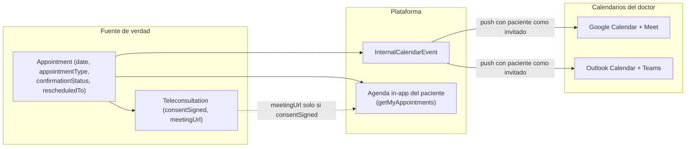

# Replicar en PawCarePlus — Calendarios (Google + Outlook), Agenda, Teleconsulta y Pre-registro

> **Dirección de replicación:** de **Medilink360 / Qlinexa360** (salud humana) → **PawCarePlus** (veterinaria).
> Documento técnico exhaustivo basado en el **estado actual en producción de Medilink360 (mayo 2026)**, tras la afinación de calendarios Google/Outlook, teleconsulta con consentimiento y el step de agendar desde la agenda compartida.
>
> **Objetivo principal solicitado:** añadir en PawCarePlus el **step de agendar cita** (que hoy falta), la **gestión de citas presencial vs virtual**, el **flujo de consentimiento de teleconsulta** y los **enlaces legales** (aviso de privacidad + términos de uso) en el pre-registro.

---

## 0. Mapeo de dominio (humano → veterinaria)

| Medilink360 (humano) | PawCarePlus (veterinaria) |
|----------------------|---------------------------|
| Paciente | Propietario + mascota |
| `Patient` (un sujeto) | `Owner` + `Pet` (dos entidades) |
| Doctor / profesional | Veterinario |
| `appointmentType: presencial \| teleconsulta` | igual (`presencial \| teleconsulta`) |
| Aviso de privacidad (LFPDPPP) | mismo marco legal, textos veterinarios |
| Pre-registro clínico (`ClinicalIntake`) | Pre-consulta / alta de mascota |
| `legal@qlinexa360.com` | `legal@pawcareplus.com` |

> En PawCarePlus el PDF de consentimiento y los formularios deben incluir **datos de la mascota** (especie, raza, peso). En todo lo demás la arquitectura es idéntica.

---

## 1. Criterios de aceptación (contrato funcional)

Estos son los criterios que se validaron en Medilink360 y que deben cumplirse en PawCarePlus. Cada uno mapea a la implementación concreta descrita más abajo.

| # | Criterio de aceptación | Dónde se cumple |
|---|------------------------|-----------------|
| C1 | La cita **siempre** se ve en la agenda del **paciente/propietario** y en la del **doctor/veterinario**. | §6 (agenda in-app del paciente: `getMyAppointments`) + §3 (push a calendarios externos con el paciente como invitado) |
| C2 | El paciente **recibe correo** (confirmación / `.ics`). | §4.3 (`createAppointment` envía email con `.ics`) + §7 (notification.service) |
| C3 | Se puede **confirmar** la cita y **se sincronizan** los calendarios (interno + Google/Outlook). | §5 (`confirm/:token` → `syncAppointmentCalendars`) |
| C4 | Se puede **reagendar** solo según los **slots disponibles de la agenda compartida** del doctor. | §5.2 (`getAvailableRescheduleSlots` usa `ScheduleService.getBookableSlotsForDate`) |
| C5 | Al reagendar, los **cambios se reflejan en ambos calendarios** (paciente y doctor). | §5.2 (`requestReschedule` actualiza `Appointment` + `syncAppointmentCalendars`) |
| C6 | Las **citas presenciales NO llevan liga** de videollamada. | §3.3 (`disableConference` + `shouldAllowVideoConferenceForAppointment`) |
| C7 | Las **citas virtuales requieren firmar el aviso de privacidad**; una vez firmado, **se activa la liga**. | §8 (teleconsulta: `signTeleconsultationConsent` → `meetingUrl`) |
| C8 | El paciente recibe **por correo la solicitud de firma** del aviso (y la liga queda en el meeting solo tras firmar). | §8.4 (correo con enlace `/teleconsulta/{token}`, NO con la liga de video) |

---

## 2. Arquitectura: fuente de verdad y sincronización



**Reglas:**

- **R1** — `Appointment` es la fuente de verdad de fecha/hora y modalidad (`appointmentType`).
- **R2** — `InternalCalendarEvent` es el espejo interno que se empuja a Google/Outlook.
- **R3** — La videollamada (Meet/Teams) **solo** existe si `appointmentType === 'teleconsulta'` **y** el consentimiento está firmado (`Teleconsultation.consentSigned === true`).
- **R4** — Para citas presenciales se envía `disableConference: true` a los servicios de sync para **eliminar** cualquier liga que el proveedor haya agregado automáticamente.
- **R5** — Push a calendarios externos con **fecha/hora local del profesional** + `timeZone` explícito.

---

## 3. Calendarios externos (Google + Outlook)

### 3.1 OAuth (multi-tenant: cada profesional conecta su propia cuenta)

**Rutas** (montadas en `/api/calendar-sync`, sin auth middleware — el `doctorId` viaja en `state`):

| Método | Ruta | Uso |
|--------|------|-----|
| GET | `/api/calendar-sync/auth/google` | Inicia OAuth Google (redirige a Google) |
| GET | `/api/calendar-sync/auth/google/callback` | Recibe `code`, intercambia tokens, guarda config |
| GET | `/api/calendar-sync/auth/outlook` | Inicia OAuth Outlook |
| GET | `/api/calendar-sync/auth/outlook/callback` | Callback Outlook |

**Scopes** (`backend/src/config/oauth.config.ts`):

```js
google: {
  scope: 'https://www.googleapis.com/auth/calendar.readonly https://www.googleapis.com/auth/calendar.events',
  authUrl: 'https://accounts.google.com/o/oauth2/v2/auth',
  tokenUrl: 'https://oauth2.googleapis.com/token'
  // authUrl extras: access_type=offline, prompt=consent, include_granted_scopes=true
},
outlook: {
  scope: 'offline_access Calendars.ReadWrite OnlineMeetings.ReadWrite'
  // OnlineMeetings.ReadWrite es necesario para crear/eliminar la reunión de Teams
}
```

**Variables de entorno** (configurar una vez en el servidor; tokens se guardan por profesional):

```bash
GOOGLE_CLIENT_ID=xxxxx.apps.googleusercontent.com
GOOGLE_CLIENT_SECRET=GOCSPX-xxxx
GOOGLE_REDIRECT_URI=https://api.pawcareplus.com/api/calendar-sync/auth/google/callback

OUTLOOK_CLIENT_ID=xxxxxxxx-xxxx-xxxx-xxxx-xxxxxxxxxxxx
OUTLOOK_CLIENT_SECRET=xxxx~xxxx
OUTLOOK_REDIRECT_URI=https://api.pawcareplus.com/api/calendar-sync/auth/outlook/callback

FRONTEND_URL=https://www.pawcareplus.com
```

> **Importante (lección aprendida en Medilink360):** la cuenta de Microsoft que conecte el profesional **debe tener buzón de Exchange Online** (los endpoints `/me/calendar` y `/me/events` devuelven 401 si no existe buzón). Cuentas tipo `admin@` sin buzón fallan. Para pruebas usar una cuenta del **Microsoft 365 Developer Program** (Exchange + Teams).

**Modelo de tokens** (`backend/prisma/schema.prisma`):

```prisma
model CalendarSyncConfig {
  id           String    @id @default(uuid())
  doctorId     String
  provider     String    // 'google' | 'outlook'
  isConnected  Boolean   @default(false)
  accessToken  String?
  refreshToken String?
  expiresAt    DateTime?
  lastSync     DateTime?
  error        String?
  doctor       Doctor    @relation(fields: [doctorId], references: [id], onDelete: Cascade)
  @@unique([doctorId, provider])
  @@map("calendar_sync_configs")
}
```

> No hay `calendarId`: Google usa el calendario `'primary'` por defecto. El **refresh de tokens** se hace en `ensureValidCredentials` (refresca si `expiresAt <= ahora+60s`) y en `executeWithRetry` (reintenta una vez en 401/403). Ver `OAuthService.refreshAccessToken(provider, refreshToken)`.

### 3.2 Servicios de sincronización

| Archivo | Responsabilidad |
|---------|-----------------|
| `backend/src/services/googleCalendarSync.service.ts` | `upsertEvent` / `deleteEvent` / `getEvent` (Google Calendar API) |
| `backend/src/services/outlookCalendarSync.service.ts` | `upsertEvent` / `deleteEvent` / `syncCalendar` (Microsoft Graph) |
| `backend/src/utils/calendarSync.utils.ts` | `shouldAllowVideoConferenceForAppointment`, `reconcileCalendarEventWithAppointment` |

**Formato de fecha para APIs externas** (clave para que la hora no se corra):

```js
// Google: dateTime local + timeZone explícito (NO ISO UTC con timeZone distinto)
start: { dateTime: formatDateTimeForExternalCalendar(date, "America/Mexico_City"), timeZone: "America/Mexico_City" }
```

### 3.3 Liga de videollamada condicional — el corazón del criterio C6/C7

#### Helper de gating (`backend/src/utils/calendarSync.utils.ts`)

```ts
/** Solo teleconsultas con consentimiento firmado deben generar enlace de videollamada. */
export function shouldAllowVideoConferenceForAppointment(
  appointmentType: string,
  teleconsultationConsentSigned?: boolean | null
): boolean {
  return appointmentType === 'teleconsulta' && teleconsultationConsentSigned === true;
}
```

> Regla: video **solo** si `appointmentType === 'teleconsulta'` **y** `consentSigned === true`. `'presencial'` siempre retorna `false`.
> Además, `reconcileCalendarEventWithAppointment` limpia `linkMeeting` cuando `appointmentType !== 'teleconsulta'`.

#### Flag `disableConference` — Google (`googleCalendarSync.service.ts`)

El payload incluye `disableConference?: boolean`. En `upsertEvent`:

```ts
const wantsConference = payload.conferenceType === 'google-meet';
const hasExistingGoogleMeet = !!existingConferenceLink && existingConferenceLink.includes('meet.google.com');
const shouldCreateConference = (wantsConference || payload.googleMeetEnabled) && !hasExistingGoogleMeet;
const shouldStripConference = payload.disableConference === true;

if (shouldCreateConference) {
  requestBody.conferenceData = {
    createRequest: { requestId: randomUUID(), conferenceSolutionKey: { type: 'hangoutsMeet' } }
  };
  // insert/patch usan conferenceDataVersion: 1
}

if (shouldStripConference) {
  // events.update (full replace) con conferenceData/hangoutLink eliminados:
  const merged = { ...existing.data, ...requestBody, conferenceData: undefined, hangoutLink: undefined };
  delete merged.conferenceData; delete merged.hangoutLink;
  await cal.events.update({ calendarId, eventId, requestBody: merged, sendUpdates: payload.sendUpdates ?? 'all' });
}
```

#### Flag `disableConference` — Outlook (`outlookCalendarSync.service.ts`)

```ts
private static buildEventBody(payload: OutlookEventPayload) {
  // Si se pide deshabilitar explícitamente, nunca habilitar Teams (presencial)
  const wantsTeams =
    !payload.disableConference &&
    (payload.teamsEnabled || payload.conferenceType === 'teams');
  return {
    subject: titleForExternal,
    /* ... start/end con timeZone, attendees ... */
    isOnlineMeeting: wantsTeams,
    onlineMeetingProvider: wantsTeams ? 'teamsForBusiness' : undefined
  };
}
```

> Cuando `disableConference === true` → `isOnlineMeeting: false` y se omite `onlineMeetingProvider`, eliminando la reunión de Teams en el evento existente.

#### Cómo lo invocan los controladores

- **Al crear evento (UI del doctor)** — `calendar.controller.ts`: el video se rige por la **plataforma elegida** (`meetingPlatform`), no por el consentimiento, y la fila de teleconsulta nace con `meetingUrl: null`:

```ts
const wantsGoogleConference =
  meetingPlatform === 'google-meet' ||
  (!!event.linkMeeting && event.linkMeeting.includes('meet.google.com'));
const wantsOutlookConference = meetingPlatform === 'teams';
// payload: disableConference: !wantsGoogleConference  /  !wantsOutlookConference
```

- **Al actualizar evento o confirmar/reagendar** — se usa el helper con consentimiento:

```ts
// calendar.controller.ts (update) y appointmentConfirmation.controller.ts (confirm/reschedule/approve)
const allowVideo = shouldAllowVideoConferenceForAppointment(appointmentType, teleconsultation?.consentSigned);
// Google: conferenceType: allowVideo ? 'google-meet' : null, googleMeetEnabled: allowVideo, disableConference: !allowVideo
// Outlook: teamsEnabled: allowVideo, disableConference: !allowVideo
```

**Resultado neto por escenario:**

| Escenario | Acción en calendario |
|-----------|----------------------|
| Presencial | `disableConference: true` → Google elimina Meet / Outlook `isOnlineMeeting:false`; `linkMeeting`/`meetingUrl` se limpian |
| Teleconsulta **sin** firmar | Se sincroniza **sin** video; `meetingUrl` queda `null`; el API público no la expone |
| Teleconsulta **firmada** | `syncAppointmentCalendars` con `allowVideo === true` crea Meet/Teams → `Teleconsultation.meetingUrl` se guarda |

---

## 4. EL STEP DE AGENDAR (lo que falta en PawCarePlus)

La agenda compartida pública permite que un propietario reserve cita eligiendo un **slot disponible** del veterinario, sin login.

### 4.1 Modelos

```prisma
// Configuración de horarios del profesional
model DoctorScheduleConfig {
  id                  String   @id @default(uuid())
  doctorId            String   @unique
  appointmentDuration Int      @default(30)   // minutos por cita
  bufferTime          Int      @default(15)   // minutos entre citas
  weeklySchedule      Json                    // por día: [{ startTime:"09:00", endTime:"13:00", isAvailable:true }, ...]
  doctor              Doctor   @relation(fields: [doctorId], references: [id], onDelete: Cascade)
  @@map("doctor_schedule_configs")
}

// Enlace público de la agenda compartida (toggle on/off + URL)
model AgendaPacientesLink {
  id             String   @id @default(dbgenerated("(gen_random_uuid())::text"))
  link           String   @unique          // slug "nombre-apellido"
  doctor_id      String
  esta_activo    Boolean? @default(false)
  mensaje_custom String?
  Doctor         Doctor   @relation(fields: [doctor_id], references: [id], onDelete: Cascade)
  @@map("agenda_pacientes_links")
}
```

### 4.2 `ScheduleService` — generación de slots (`backend/src/services/schedule.service.ts`)

```ts
const ACTIVE_CONFIRMATION_STATUSES = ['PENDING', 'CONFIRMED', 'RESCHEDULED'] as const;

// Genera los slots teóricos del día según weeklySchedule + duración + buffer
static async generateAvailableSlots(doctorId, date, timezone): Promise<Date[]> {
  const config = await this.getScheduleConfig(doctorId);
  const daySchedule = config.weeklySchedule[dayName]; // p. ej. "monday"
  for (const timeSlot of daySchedule) {
    if (!timeSlot.isAvailable) continue;
    let currentSlot = createDateInTimezone(year, month, day, startHour, startMinute, tz);
    const slotEnd = createDateInTimezone(year, month, day, endHour, endMinute, tz);
    while (currentSlot < slotEnd) {
      if (slotEndTime <= slotEnd) availableSlots.push(new Date(currentSlot));
      currentSlot = new Date(currentSlot.getTime() + (config.appointmentDuration + config.bufferTime) * 60000);
    }
  }
  return availableSlots;
}

// Slots REALMENTE reservables: quita citas activas + eventos internos ocupados (con buffer)
static async getBookableSlotsForDate(doctorId, dateInput, options): Promise<BookableSlotDto[]> {
  const availableSlots = await this.generateAvailableSlots(doctorId, targetDate, tz);
  const occupiedAppointments = await prisma.appointment.findMany({
    where: { doctorId, date: { gte: dateStart, lt: dateEnd },
             status: { not: 'CANCELLED' }, confirmationStatus: { in: [...ACTIVE_CONFIRMATION_STATUSES] },
             ...(options.excludeAppointmentId ? { id: { not: options.excludeAppointmentId } } : {}) },
    select: { id: true, date: true }
  });
  // ...también consulta internalCalendarEvent ocupados...
  // filtra solapamientos con buffer y devuelve { id, startTime, endTime, displayTime }
}

// ¿Este slot puntual sigue reservable? (para validar al confirmar reagenda)
static async isSlotBookable(doctorId, slotTime, options): Promise<boolean> { /* delega a getBookableSlotsForDate */ }
```

### 4.3 Endpoints públicos de agenda (`/api/agenda-pacientes`)

```ts
// backend/src/routes/agendaPacientes.routes.ts
router.get('/doctor/:doctorUsername', AgendaPacientesController.getDoctorInfo);
router.get('/doctor/:doctorUsername/slots', AgendaPacientesController.getAvailableSlots);   // ?fecha=YYYY-MM-DD
router.post('/doctor/:doctorUsername/appointment', AgendaPacientesController.createAppointment);
```

**Crear cita** (`createAppointment`) — body `{ slotId, patientName, patientEmail, patientPhone, motivoConsulta }`:

```ts
const appointment = await prisma.appointment.create({
  data: {
    doctorId: agendaConfig.doctor_id,
    patientId: patient.id,
    doctorPatientId: doctorPatient.id,
    userId: patient.userId,
    date: slotTime,
    status: 'SCHEDULED',
    confirmationStatus: 'PENDING',     // queda pendiente de aprobación del doctor
    notes: `Cita creada desde link público - ${motivoConsulta}`
  }
});
// también crea internalCalendarEvent, pre-consulta opcional y envía email con .ics
// NO sincroniza calendarios externos hasta que el doctor aprueba la cita
```

**Frontend:** `frontend/src/pages/AgendarCita.jsx`, ruta `/agendar/:doctorUsername`.
- Listar slots: `GET /api/agenda-pacientes/doctor/${doctorUsername}/slots?fecha=${fecha}`
- Reservar: `POST /api/agenda-pacientes/doctor/${doctorUsername}/appointment`

> **Gotcha a replicar con cuidado:** el endpoint público `getAvailableSlots` históricamente solo bloqueaba citas `CONFIRMED`, mientras que `getBookableSlotsForDate` (usado en reagenda) bloquea `PENDING | CONFIRMED | RESCHEDULED`. **Recomendación para PawCarePlus:** unificar ambos para usar `getBookableSlotsForDate` y evitar doble reserva del mismo horario.

---

## 5. Flujo público de confirmación / cancelación / reagenda

Rutas montadas en `/api/appointment-confirmation` (token = `AppointmentConfirmationRequest.confirmationToken`):

| Método | Ruta | Uso |
|--------|------|-----|
| GET | `/info/:token` | Datos de la cita (incluye `appointmentType`) |
| POST | `/confirm/:token` | Confirmar asistencia → `syncAppointmentCalendars` |
| POST | `/cancel/:token` | Cancelar |
| GET | `/reschedule/:token/available-slots?date=YYYY-MM-DD` | Slots reservables |
| POST | `/reschedule/:token` | Reagendar |

**Frontend público:** `/confirm-appointment/:token` (`ConfirmAppointment.jsx`).

> **Redirección clave (C7/C8):** `/info/:token` devuelve `appointmentType`. Si es `teleconsulta`, `ConfirmAppointment.jsx` redirige a `/teleconsulta/:token` para que **cualquier** enlace (correo o invitación de calendario) lleve al flujo de firma:
> ```jsx
> if (data.appointmentType === 'teleconsulta') { navigate(`/teleconsulta/${token}`, { replace: true }); return; }
> ```

### 5.1 Confirmar

`confirm/:token` actualiza `confirmationStatus: CONFIRMED` y llama a `syncAppointmentCalendars(appointmentId)` que:
1. Busca/crea el `InternalCalendarEvent`.
2. Hace push a Google/Outlook **con el paciente como invitado** (para C1: aparece en el calendario del paciente vía invitación de correo).
3. Si es teleconsulta firmada, propaga `meetingUrl`.

### 5.2 Reagendar (C4 + C5)

**Listar slots** — usa exactamente la agenda compartida del doctor:

```ts
const slots = await ScheduleService.getBookableSlotsForDate(doctorId, date as string, {
  excludeAppointmentId: confirmationRequest.appointmentId,   // no contar la propia cita
  timezone: doctorTimezone
});
```

**Confirmar reagenda** — valida el slot, actualiza la cita y re-sincroniza ambos calendarios:

```ts
const slotBookable = await ScheduleService.isSlotBookable(doctorId, requestedDateTime, {
  excludeAppointmentId: confirmationRequest.appointmentId, timezone: doctorTimezone
});
// si reservable:
await prisma.appointment.update({
  where: { id: confirmationRequest.appointmentId },
  data: {
    date: requestedDateTime,
    status: 'SCHEDULED',
    confirmationStatus: 'RESCHEDULED',
    rescheduledFrom: confirmationRequest.appointment.date,
    rescheduledTo: requestedDateTime,
    cancelledAt: null, cancellationReason: null
  }
});
await AppointmentConfirmationController.syncAppointmentCalendars(confirmationRequest.appointmentId);
```

`syncAppointmentCalendars` mueve `fechaHoraInicio/Fin` del evento interno a la nueva fecha y hace `upsertEvent` con `sendUpdates: 'all'` (Google) / notificación de cambio (Outlook), de modo que **paciente y doctor** ven el cambio.

**Reagenda desde la UI del staff (calendario interno):** `GET /api/calendar/reschedule-slots?date=&excludeAppointmentId=&excludeEventId=` → también usa `getBookableSlotsForDate`.

---

## 6. Agenda in-app del paciente (C1)

`GET /api/patients/my/appointments` (auth rol `PATIENT`) → `patient.controller.ts::getMyAppointments`:

```ts
const appointments = await prisma.appointment.findMany({
  where: {
    OR: [{ patientId: patient.id }, { userId: req.user.userId }],   // robusto ante doble vínculo
    confirmationStatus: { in: ['PENDING', 'CONFIRMED', 'RESCHEDULED'] },
    date: { gte: from }      // desde hace 14 días
  },
  include: {
    doctor: { include: { user: true } },
    teleconsultation: { select: { meetingUrl: true, consentSigned: true } }
  },
  orderBy: { date: 'asc' }, take: 50
});
```

La respuesta incluye `manageLink` (`/teleconsulta/{token}` o `/confirm-appointment/{token}`), `meetingUrl`, `consentSigned`, `rescheduledFrom`, `rescheduledTo`. Esto garantiza que **la teleconsulta confirmada aparezca en la agenda del paciente** con su acción correcta.

---

## 7. Notificaciones por correo (C2, C8)

`backend/src/services/notification.service.ts`:

- `sendCalendarEventEmail` — correo de cita con `.ics` adjunto. Para teleconsulta incluye un **bloque destacado de firma** con enlace a `/teleconsulta/{token}` y un **descargo legal en texto** (aviso de privacidad). **No** incluye la liga de video antes de firmar.
- `sendConsentDocumentsToRecipient` — adjunta los PDFs legales (`Aviso_Privacidad.pdf`, `Terminos_Uso.pdf`, `Contrato_Uso_Plataforma.pdf`).

| Momento | Destinatario | Contenido |
|---------|--------------|-----------|
| Confirmación de cita (teleconsulta) | Paciente | Enlace a **firmar consentimiento** (`/teleconsulta/{token}`), NO la liga de video |
| Tras firmar consentimiento | Doctor/Veterinario | PDF del consentimiento adjunto |
| Tras firmar consentimiento | `legal@<dominio>` | PDF del consentimiento (trazabilidad) |

---

## 8. Teleconsulta + consentimiento (C7, C8)

### 8.1 Modelos

```prisma
model Teleconsultation {
  id                  String    @id @default(uuid())
  appointmentId       String    @unique
  videoProvider       String    @default("google_meet")  // google_meet | teams
  externalEventId     String?
  meetingUrl          String?
  consentSigned       Boolean   @default(false)
  consentPdfUrl       String?
  consentDocumentHash String?
  consentSignedAt     DateTime?
  consentIp           String?
  appointment         Appointment @relation(fields: [appointmentId], references: [id], onDelete: Cascade)
  @@map("teleconsultations")
}

model TeleconsultationAuditLog {
  id                 String   @id @default(uuid())
  teleconsultationId String
  action             String   // CONSENT_REQUESTED | CONSENT_SIGNED | PDF_GENERATED | PDF_SENT | MEETING_ACCESS
  userId String?  ip String?  userAgent String?  metadata Json?
  createdAt DateTime @default(now())
}
```

### 8.2 Endpoints (`/api/teleconsultation`, públicos, token = confirmationToken)

| Método | Ruta | Uso |
|--------|------|-----|
| GET | `/info/:token` | Info de la cita; **`meetingUrl` solo si `consentSigned && meetingUrl`** |
| POST | `/sign-consent/:token` | Firmar consentimiento (`{ signature }`, mín. 3 caracteres) |

```ts
// getTeleconsultationInfoByToken — meetingUrl bloqueado hasta firmar
if (teleconsultation.consentSigned && teleconsultation.meetingUrl) {
  response.meetingUrl = teleconsultation.meetingUrl;
}
```

### 8.3 Flujo de firma (`signTeleconsultationConsent`)

1. Validar `signature` (mín. 3 caracteres) y que la cita sea `teleconsulta`.
2. Si ya estaba firmado → devolver el `meetingUrl` existente.
3. `TeleconsultationConsentPdfService.generateAndUpload` (Puppeteer + Handlebars `teleconsultation-consent-template.html` → SHA-256 → S3 / local).
4. Update `Teleconsultation`: `consentSigned: true`, PDF url/hash, IP, timestamp.
5. `syncAppointmentCalendars(appointmentId, { responseStatus: 'accepted' })` → crea Meet/Teams y guarda `meetingUrl`.
6. Audit logs + correos (doctor + legal) con el PDF.
7. Respuesta incluye `meetingUrl` (ya disponible).

### 8.4 Frontend

- **Ruta:** `/teleconsulta/:token` → `frontend/src/pages/TeleconsultationConsent.jsx`.
- `GET /api/teleconsultation/info/${token}` para cargar estado.
- `POST /api/teleconsultation/sign-consent/${token}` con `{ signature }`.
- El botón "Unirse a la videollamada" solo aparece cuando el API devuelve `meetingUrl` (post-firma).
- El **PDF de consentimiento incluye el aviso de privacidad integrado** (LFPDPPP / equivalente veterinario), datos del propietario y mascota, datos del profesional, fecha/hora, firma (nombre), IP y hash.

---

## 9. Pre-registro / pre-consulta (`ClinicalIntake`) + enlace a agenda

### 9.1 Modelos

```prisma
model ClinicalIntake {
  id                        String   @id @default(uuid())
  token                     String   @unique
  doctorId                  String
  patientId                 String?
  appointmentId             String?      // opcional: vínculo a cita
  status                    ClinicalIntakeStatus @default(DRAFT)
  formData                  Json?
  consultationReason        String?
  consentPrivacy            Boolean  @default(false)   // aviso de privacidad
  consentTreatment          Boolean  @default(false)   // tratamiento de datos de salud
  consentPlatform           Boolean  @default(false)   // contrato + términos de uso
  consentSignerName         String?
  consentSignedAt           DateTime?
  consentIp                 String?
  consentFileId             String?
  consentPdfUrl             String?
  consentDocumentHash       String?
  staffNotes                String?
  expiresAt                 DateTime?
  linkNeverExpires          Boolean  @default(false)
  convertedClinicalCaseId   String?
  convertedMedicalRecordId  String?
}
// enum ClinicalIntakeStatus { DRAFT | SUBMITTED_PENDING_VALIDATION | APPROVED | REJECTED | CONVERTED }

// En Doctor:
//   intakePortalToken String? @unique
//   intakePortalSlug  String? @unique
// URL pública del portal: {FRONTEND_URL}/pre-consulta/{intakePortalSlug}
```

### 9.2 Rutas (`/api/clinical-intakes`)

**Públicas (sin JWT):**

| Método | Ruta | Uso |
|--------|------|-----|
| GET | `/public/doctor/:doctorSlug` | Info del portal (doctor, motivos, agenda) |
| POST | `/public/doctor/:doctorSlug/start` | Crear DRAFT, devuelve `token` |
| GET | `/public/:token` | Cargar borrador + plantillas + agenda |
| PUT | `/public/:token` | Guardar borrador |
| POST | `/public/:token/submit` | Enviar + consentimientos + PDF |
| POST | `/public/:token/upload` | Subir archivo por categoría (S3) |

**Staff (JWT):** `GET /portal-link`, `POST /portal-link/regenerate`, `GET /` (listar), `GET /:id`, `PATCH /:id` (APPROVED/REJECTED + notas), `POST /:id/convert`, `POST /send-link`.

### 9.3 Catálogos del formulario (`backend/src/constants/clinicalIntake.constants.ts`)

```ts
export const INTAKE_REASONS = [
  { value: 'GENERAL_MEDICINE', label: 'Medicina general' },   // primero
  { value: 'FOLLOW_UP', label: 'Seguimiento' },
  // ... CARDIOLOGY, DERMATOLOGY, GYNECOLOGY, PEDIATRICS, MENTAL_HEALTH, TELEMEDICINE, URGENCY
];
export const INTAKE_FILE_CATEGORIES = [
  { code: 'PREREG_VACCINATION_CARD', label: 'Cartilla de vacunación' },
  { code: 'PREREG_PRIOR_STUDIES', label: 'Estudios previos (laboratorio o imagen)' },
  { code: 'PREREG_PRIOR_PRESCRIPTION', label: 'Recetas o tratamientos actuales' },
  { code: 'PREREG_LESION_PHOTO', label: 'Fotos de síntomas o lesiones' },
  { code: 'PREREG_OWNER_ID', label: 'Identificación oficial' },
  { code: 'PREREG_INSURANCE', label: 'Póliza o credencial de seguro' }
];
export const INTAKE_LINK_EXPIRY_DAYS = 14;
```

> **Para PawCarePlus:** reemplazar/añadir motivos veterinarios (grooming, vacunación animal, desparasitación) y un paso de **datos de la mascota** (especie, raza, peso). El paso humano "datos de salud" pasa a "datos de la mascota + antecedentes".

### 9.4 Pasos del formulario público (`frontend/src/pages/PreRegistroPublic.jsx`)

`formData` por secciones: `patient` (datos), `additional` (género, alergias, crónicos, contacto de emergencia), `health` (motivo + datos médicos + campos dinámicos por especialidad), `attachments`, `scheduling` (reservado), `consultationReason`.

Wizard: **0** Tus datos → **1** Datos de salud → **2** Archivos → **3** Agenda / Enviar.

### 9.5 Vínculo pre-registro → step de agendar (clave para PawCarePlus)

En el **paso 3** el formulario abre la agenda compartida en una pestaña nueva, pasando el token del intake para **pre-llenar** los datos del propietario:

```jsx
// PreRegistroPublic.jsx — construye el link de agenda con el token del intake
url.searchParams.set('clinicalIntake', intakeTokenForAgenda);
// → /agendar/{slug}?clinicalIntake={token}

const handleOpenAgenda = async () => {
  const url = agendaLinkForBooking || agendaLink;
  await saveDraft({ silent: true });             // guarda antes de salir
  window.open(url, '_blank', 'noopener,noreferrer');
};
```

Y `AgendarCita.jsx` lee `?clinicalIntake={token}` → `GET /api/clinical-intakes/public/${token}` para precargar nombre/email/teléfono del propietario en el formulario de reserva.

> **Esto es exactamente "el step de agendar" que falta en PawCarePlus:** el pre-registro (alta de mascota + consentimientos) y, al final, un botón que abre la **agenda compartida del veterinario** con los datos ya capturados, donde el propietario elige un slot disponible y se crea el `Appointment`.

### 9.6 Convertir a expediente (`convertStaff`)

> **Importante:** `convert` **NO crea la cita**. Crea/vincula `Patient` + `User` + `DoctorPatient`, crea `ClinicalCase`, crea `MedicalRecord` (con `formData` fusionado), vincula archivos + PDF de consentimiento, y marca el intake `CONVERTED`. **El agendado es independiente** (vía agenda compartida del §4) — el `appointmentId` del intake solo se setea si el staff usó `send-link` con `appointmentId`.

### 9.7 Tres consentimientos + PDF

`submitPublic` exige `consentPrivacy && consentTreatment && consentPlatform` y `consentSignerName` (≥3 chars). Genera el PDF con `ClinicalIntakeConsentPdfService.generateAndPersist`, que incluye los **tres documentos legales** desde `CONSENT_CONTENT` (`consentPdf.service.ts`): `PRIVACY_POLICY`, `TERMS_OF_SERVICE` (incluye sección de referidos), `PLATFORM_CONTRACT`. Estado pasa a `SUBMITTED_PENDING_VALIDATION`.

---

## 10. Enlaces legales (aviso de privacidad + términos de uso)

### 10.1 Rutas frontend

```jsx
// frontend/src/App.jsx
<Route path="/aviso-privacidad" element={<PublicLayout><AvisoPrivacidad /></PublicLayout>} />
<Route path="/terminos"        element={<PublicLayout><TerminosDeUso /></PublicLayout>} />
// (con y sin barra final)
```

| Path | Componente |
|------|------------|
| `/aviso-privacidad` | `AvisoPrivacidad.jsx` → `PrivacyPolicyFullBody` |
| `/terminos` | `TerminosDeUso.jsx` (incluye ancla `#contrato-plataforma`) |

### 10.2 Fuentes legales backend (para PDFs y correos)

- `backend/src/legal/privacyPolicyPdfHtml.ts` → `PRIVACY_POLICY_PDF_HTML`
- `backend/src/legal/referralProgramTermsPdfHtml.ts` → `REFERRAL_PROGRAM_TERMS_PDF_HTML` (sección referidos dentro de Términos)
- Ambos se consumen en `backend/src/services/consentPdf.service.ts` → `CONSENT_CONTENT`.

### 10.3 Dónde se muestran los enlaces legales al usuario público

| Lugar | URLs usadas |
|-------|-------------|
| Step de consentimiento del pre-registro (`PreRegistroPublic.jsx`) | `/aviso-privacidad`, `/terminos#contrato-plataforma`, `/terminos` |
| Registro de paciente (`RegisterPatient.jsx`) | absolutas: `https://www.<dominio>/aviso-privacidad`, `.../terminos` |
| Header / Footer del sitio | relativas `/aviso-privacidad`, `/terminos` |
| Consentimiento teleconsulta (`TeleconsultationConsent.jsx`) | texto inline (sin link) + PDF generado al firmar |
| Correos de cita | texto legal inline; el PDF se adjunta tras firmar |

> **Para PawCarePlus:** añadir las rutas `/aviso-privacidad` y `/terminos`, el helper `LegalDocLink` (abre en pestaña nueva) y exhibir los 3 checkboxes de consentimiento en el step final del pre-registro, enlazando a esas páginas. La base de URLs absolutas en correos sale de `FRONTEND_URL`.

---

## 11. Orden sugerido de implementación en PawCarePlus

1. **Modelos:** `appointmentType` en `Appointment`, `Teleconsultation`, `CalendarSyncConfig`, `DoctorScheduleConfig`, `AgendaPacientesLink`, `ClinicalIntake` + `Doctor.intakePortalSlug` (todas las migraciones **aditivas**, sin perder datos).
2. **OAuth calendarios** (`/api/calendar-sync/...`) + variables de entorno Google/Outlook + `CalendarSyncConfig`.
3. **Servicios de sync** Google/Outlook con `disableConference` y `shouldAllowVideoConferenceForAppointment`.
4. **ScheduleService** + **agenda compartida pública** (`/api/agenda-pacientes`) → **step de agendar** (`/agendar/:slug`). ← prioridad del usuario.
5. **Confirmación/cancelación/reagenda** por token (`/api/appointment-confirmation`) usando `getBookableSlotsForDate`.
6. **Agenda in-app del paciente** (`getMyAppointments`).
7. **Teleconsulta + consentimiento** (`/api/teleconsultation`, redirect `/teleconsulta/:token`, PDF con aviso de privacidad).
8. **Pre-registro** (`/api/clinical-intakes`) + vínculo al step de agendar (`?clinicalIntake={token}`).
9. **Páginas legales** `/aviso-privacidad` y `/terminos` + 3 consentimientos.

---

## 12. Lista de verificación (QA) para PawCarePlus

- [ ] **C1** Cita visible en agenda del propietario (in-app) y del veterinario (calendario externo con invitación).
- [ ] **C2** El propietario recibe correo con `.ics` al agendar.
- [ ] **C3** Confirmar cita sincroniza interno + Google/Outlook.
- [ ] **C4** Reagenda muestra **solo** slots disponibles de la agenda compartida (`getBookableSlotsForDate`).
- [ ] **C5** Reagenda actualiza `Appointment` (+`rescheduledFrom/To`) y refleja en ambos calendarios (`sendUpdates`).
- [ ] **C6** Cita presencial **sin** liga (Google strip Meet / Outlook `isOnlineMeeting:false`; `linkMeeting`/`meetingUrl` limpios).
- [ ] **C7** Teleconsulta exige firmar aviso; tras firmar se crea Meet/Teams y se expone `meetingUrl`.
- [ ] **C8** Correo con enlace a `/teleconsulta/{token}` (firma), no la liga directa.
- [ ] Cuenta Microsoft de prueba con **buzón Exchange + Teams** (Microsoft 365 Developer Program).
- [ ] Unificar slots públicos y de reagenda en `getBookableSlotsForDate` (evitar doble reserva).
- [ ] Step de agendar accesible desde el pre-registro con datos precargados (`?clinicalIntake={token}`).
- [ ] Textos legales y PDF adaptados a veterinaria (mascota/propietario), revisados por jurídico.

---

## 13. Archivos de referencia en Medilink360 (para copiar/adaptar)

### Calendarios y citas
- `backend/src/services/googleCalendarSync.service.ts`
- `backend/src/services/outlookCalendarSync.service.ts`
- `backend/src/utils/calendarSync.utils.ts` (`shouldAllowVideoConferenceForAppointment`, `reconcileCalendarEventWithAppointment`)
- `backend/src/config/oauth.config.ts` · `backend/src/services/oauth.service.ts`
- `backend/src/controllers/calendar.controller.ts`
- `backend/src/controllers/appointmentConfirmation.controller.ts` (`syncAppointmentCalendars`)
- `backend/src/controllers/calendarSync.controller.ts`
- `backend/src/services/schedule.service.ts`
- `backend/src/controllers/agendaPacientes.controller.ts`
- `backend/src/routes/{calendarSync,appointmentConfirmation,agendaPacientes}.routes.ts`
- `frontend/src/pages/{AgendarCita,ConfirmAppointment}.jsx`

### Teleconsulta
- `backend/src/controllers/teleconsultation.controller.ts`
- `backend/src/services/teleconsultationConsentPdf.service.ts`
- `backend/src/templates/teleconsultation-consent-template.html`
- `frontend/src/pages/TeleconsultationConsent.jsx`

### Pre-registro y legales
- `backend/src/controllers/clinicalIntake.controller.ts` · `backend/src/routes/clinicalIntake.routes.ts`
- `backend/src/constants/clinicalIntake.constants.ts`
- `backend/src/services/clinicalIntakeConsentPdf.service.ts` · `backend/src/services/consentPdf.service.ts`
- `backend/src/legal/{privacyPolicyPdfHtml,referralProgramTermsPdfHtml}.ts`
- `frontend/src/pages/{PreRegistroPublic,AvisoPrivacidad,TerminosDeUso}.jsx`

### Patient agenda
- `backend/src/controllers/patient.controller.ts` (`getMyAppointments`)

### Migraciones Prisma relevantes (aditivas)
- `20260319000000_add_teleconsultation`
- `20260528120000_clinical_intake_preregistro`
- (+ las de schedule config / agenda pacientes ya existentes)

---

## 12. Adenda — Fixes y mejoras (29 mayo 2026)

> Esta sección complementa el contexto entregado ayer con los **4 cambios** afinados hoy en Medilink360. Todos están en producción y verificados por QA (regla de video 4/4, slots OK, builds OK, sin regresiones). Replicar igual en PawCarePlus.

### Criterios de aceptación añadidos

| # | Criterio | Dónde se cumple |
|---|----------|-----------------|
| C9 | El invite del paciente muestra **una sola liga** de video (la vigente), nunca duplicada tras reprogramar. | §12.1 |
| C10 | El **paciente** puede **reprogramar y cancelar** también las **teleconsultas** (no solo el doctor). | §12.2 |
| C11 | **Firmar el consentimiento confirma la cita** (no queda en PENDING). | §12.3 |
| C12 | **Cualquier cita** (crear, editar, reprogramar) **requiere el calendario del doctor enlazado**; sin él, el paciente solo recibiría correo y no vería la cita en su dispositivo. | §12.4 |

### 12.1 Liga de video no duplicada en el calendario del paciente

**Síntoma:** tras reprogramar una teleconsulta, el invitado (p. ej. en Outlook) veía **dos** ligas: la nueva (nativa) y una vieja que había quedado en el campo `location` del evento.

**Causa:** la liga de Meet/Teams se escribía también en `location`. El cliente del paciente mostraba `location` **además** de la liga nativa (`conferenceData` en Google / `onlineMeeting` en Teams).

**Fix (regla de oro):** la liga de videollamada vive **solo** en el campo nativo de conferencia; `location` nunca debe contener una URL de video. Se limpia de forma central en `buildEventBody` de **ambos** servicios de sync:

```ts
// googleCalendarSync.service.ts y outlookCalendarSync.service.ts (buildEventBody)
// Si location trae una URL de video (vieja), se envía '' para borrarla en el evento del invitado.
location: /meet\.google\.com|teams\.microsoft\.com|zoom\.us/i.test(payload.location ?? '')
  ? ''
  : (payload.location ?? '')
// En Outlook, location es un objeto: { displayName: <mismo cálculo> }
```

> PawCarePlus: aplicar idéntico en sus dos `buildEventBody`. La liga solo en `conferenceData`/`onlineMeeting`.

### 12.2 El paciente puede reprogramar/cancelar teleconsultas

**Síntoma:** el paciente podía reprogramar presenciales, pero las teleconsultas redirigían a `/teleconsulta/{token}`, página que solo permitía firmar y unirse.

**Fix:** la página de teleconsulta (`TeleconsultationConsent.jsx`) reutiliza los **mismos endpoints públicos por token** que el flujo presencial:
- `GET /api/appointment-confirmation/reschedule/:token/available-slots?date=...` (solo slots de la agenda compartida).
- `POST /api/appointment-confirmation/reschedule/:token`
- `POST /api/appointment-confirmation/cancel/:token`

La sección "¿Necesitas cambiar tu cita?" se muestra **antes y después** de firmar. El backend de reagenda es **agnóstico al tipo** (no filtra por `appointmentType`), así que no requirió cambios de servidor.

> PawCarePlus: exponer "Reprogramar/Cancelar" en la página de teleconsulta reutilizando los endpoints por token; no dupliques lógica de servidor.

### 12.3 Firmar el consentimiento confirma la cita

**Síntoma:** tras firmar, la cita seguía como no confirmada (`confirmationStatus = PENDING`) y la solicitud quedaba sin responder. Parecía "faltar el botón de confirmar".

**Causa:** `signTeleconsultationConsent` solo ponía `status = SCHEDULED`, a diferencia de `confirmAppointment` (presencial) que sí marca `CONFIRMED`.

**Fix (backend):** firmar = confirmar.

```ts
// teleconsultation.controller.ts → signTeleconsultationConsent (tras firmar)
await prisma.appointment.update({
  where: { id: appointment.id },
  data: { status: 'SCHEDULED', confirmationStatus: 'CONFIRMED', confirmedAt: new Date(),
           cancelledAt: null, cancellationReason: null }
});
await prisma.appointmentConfirmationRequest.update({
  where: { id: confirmationRequest.id },
  data: { status: 'RESPONDED', patientResponse: 'CONFIRMED', respondedAt: new Date() }
});
// …luego syncAppointmentCalendars(appointmentId, { responseStatus: 'accepted' })
```

**Fix (frontend):** botón **"Confirmar asistencia y firmar consentimiento"**, nota de que firmar confirma la asistencia, y vista posterior **"Asistencia confirmada / Cita confirmada"**.

> PawCarePlus: para teleconsulta, firmar el consentimiento ES la confirmación (es una acción afirmativa más fuerte que un simple "confirmar"). No agregues un botón "confirmar" separado.

### 12.4 Toda cita requiere el calendario del doctor enlazado

**Regla de negocio:** la invitación al **calendario del dispositivo del paciente** se envía a través del calendario externo del doctor (Google/Outlook, como invitado). Sin calendario enlazado, el paciente **solo recibe correo** y no ve la cita en su agenda. Por eso **cualquier movimiento de calendario** debe exigir el enlace.

**Crear** (`createCalendarEvent`): se valida temprano según el `origenEvento` seleccionado (que define a qué calendario se sincroniza):

```ts
const requestedProvider = String(origenEvento || '').toLowerCase();
if (requestedProvider === 'google' || requestedProvider === 'outlook') {
  const conn = await prisma.calendarSyncConfig.findFirst({
    where: { doctorId: doctor.id, provider: requestedProvider, isConnected: true }
  });
  if (!conn) {
    const label = requestedProvider === 'google' ? 'Google' : 'Microsoft Outlook';
    throw new AppError(
      `Para crear una cita debes enlazar tu calendario de ${label} en Configuración → Calendario. ` +
      `La invitación al calendario del paciente se envía a través de tu calendario; sin enlazarlo, ` +
      `el paciente solo recibiría un correo y no vería la cita en su dispositivo.`, 400);
  }
}
```

**Editar / reprogramar** (`updateCalendarEvent`): se valida contra el proveedor al que está vinculado el evento; si se desconectó, se bloquea. **Cancelar NO se bloquea** (endpoint aparte) y los eventos **internos** (sin proveedor externo) tampoco:

```ts
const editProvider = String(existingEvent.externalProvider || existingEvent.origenEvento || '').toLowerCase();
if (editProvider === 'google' || editProvider === 'outlook') {
  const conn = await prisma.calendarSyncConfig.findFirst({
    where: { doctorId: doctor.id, provider: editProvider, isConnected: true }
  });
  if (!conn) throw new AppError(`Para modificar o reprogramar esta cita necesitas tener enlazado tu calendario de ${editProvider === 'google' ? 'Google' : 'Microsoft Outlook'}…`, 400);
}
```

**Frontend (UX inmediata):** el modal de creación recibe el estado de conexión (`supportsGoogleMeet`/`supportsTeams`, desde `/api/calendar-sync/sync-status`). Si el calendario elegido no está enlazado:
- Muestra un aviso en rojo bajo "Origen del evento".
- **Deshabilita** el botón "Crear Cita".
En edición, el error del backend se muestra por toast (`error.response.data.message`).

> PawCarePlus: misma regla. Para teleconsulta, el proveedor debe ser uno con video (Google/Outlook). Considera que en veterinaria un mismo evento puede involucrar **propietario + mascota**: el invitado del calendario es el **email del propietario**.

### 12.5 Vínculo duro cita↔evento (fin del colapso de citas) — CRÍTICO

**Síntoma (bug grave):** al crear una cita nueva para un paciente, **todas sus citas anteriores "se movían"** a la fecha/hora de la nueva (p. ej. todas al 8-jun 9:00). Además: la descripción del evento **acumulaba varias ligas** "Gestiona tu cita", se **confirmaban citas hermanas** por error, y se generaba una **tormenta de `PATCH`** a Google que terminaba en `403 Rate Limit Exceeded`.

**Causa raíz (arquitectónica):** **no existía un vínculo duro** entre `Appointment` ↔ `InternalCalendarEvent` ↔ evento externo. Todo se emparejaba **por heurística**: `(doctorId + patientId + ventana de tiempo)` — ±30 min en `syncAppointmentCalendars`, ±2 h al crear, y `paciente + ventana` en el sync inverso Google→app. Cuando un mismo paciente tenía **varias citas cercanas en hora**, esas heurísticas **colapsaban varias citas en un solo evento** (un único `externalEventId`), cuya fecha la pisaba la última sincronización.

**Fix (4 partes):**

1. **Esquema + migración aditiva.** `InternalCalendarEvent` gana `appointmentId String? @unique` con FK a `Appointment` y `onDelete: SetNull`. Es nullable → multi-NULL permitido en Postgres, sin conflicto con datos existentes.

```prisma
model InternalCalendarEvent {
  // …
  appointmentId String?      @unique
  appointment   Appointment? @relation("AppointmentCalendarEvent", fields: [appointmentId], references: [id], onDelete: SetNull)
}
// Appointment: internalCalendarEvent InternalCalendarEvent? @relation("AppointmentCalendarEvent")
```

2. **`createCalendarEvent`** setea `appointmentId` al crear el evento. Si la cita fue **reutilizada** y ya tenía evento enlazado, **actualiza ese evento** en vez de crear uno nuevo (lo exige el índice `@unique`).

3. **`syncAppointmentCalendars`** empareja en orden: (a) `findUnique({ where: { appointmentId } })` (vínculo duro); (b) fallback por ventana de tiempo **SOLO sobre eventos no reclamados** (`appointmentId: null`), para no robar el evento de otra cita; al crear/actualizar, **reclama** el vínculo (`appointmentId: appointment.id`).

```ts
let calendarEvent = await prisma.internalCalendarEvent.findUnique({
  where: { appointmentId: appointment.id }
});
if (!calendarEvent) {
  calendarEvent = await prisma.internalCalendarEvent.findFirst({
    where: { doctorId, patientId, appointmentId: null, fechaHoraInicio: { gte, lte } }
  });
}
```

4. **Sync inverso (Google→app), confirmación por respuesta del invitado.** Antes resolvía la cita por `paciente + ventana ±30min` con `findFirst` → confirmaba una cita **hermana** arbitraria. Ahora resuelve la cita **de forma determinista** vía el FK del evento interno (matcheado por `externalEventId`); el fallback por tiempo solo aplica si no hay vínculo duro.

```ts
const linkedInternalEvent = await prisma.internalCalendarEvent.findUnique({
  where: { id: eventId }, select: { appointmentId: true }
});
let appointment = linkedInternalEvent?.appointmentId
  ? await prisma.appointment.findUnique({ where: { id: linkedInternalEvent.appointmentId }, select: { id: true } })
  : null;
// solo si !appointment → fallback heredado por email + ventana de tiempo
```

> PawCarePlus: **replica el FK y el emparejamiento por él** en los tres puntos (creación, `syncAppointmentCalendars`, sync inverso). La ventana de tiempo queda **solo como fallback para datos legados** (`appointmentId = null`). Sin esto, en cuanto un propietario tenga 2+ citas próximas para sus mascotas, se reproducirá el colapso.

**Limpieza de datos legados.** Los eventos creados antes del fix tienen `appointmentId = NULL` (inofensivo: el fallback solo toca eventos no reclamados). Si hay datos de prueba "encimados", existe `backend/scripts/cleanup-test-patient-appointments.js` (dry-run por defecto; borra con `--apply`, apuntando por email).

### Notas de QA / datos legacy
- Los datos previos al fix de gating (citas de ene–abr 2026) pueden tener `linkMeeting` en presenciales pasadas o `meetingUrl` en teleconsultas no firmadas. **No se exponen** (el API filtra) y **se auto-corrigen** al re-sincronizar el evento (un edit/reagenda dispara `disableConference` + limpieza de `location`). Opcional: script de limpieza puntual.
- Pendiente de entorno (no de código): validar Teams en vivo con una cuenta Microsoft **con buzón Exchange** (cuenta corporativa con Exchange Online + Teams; requiere **consentimiento de admin** del tenant para `Calendars.ReadWrite` y `OnlineMeetings.ReadWrite`).

### Archivos tocados (referencia)
- `backend/src/services/googleCalendarSync.service.ts` · `backend/src/services/outlookCalendarSync.service.ts` (limpieza de `location`)
- `backend/src/controllers/teleconsultation.controller.ts` (firmar = confirmar)
- `backend/src/controllers/calendar.controller.ts` (`createCalendarEvent`, `updateCalendarEvent`: calendario enlazado + setear `appointmentId`)
- `backend/src/controllers/appointmentConfirmation.controller.ts` (`syncAppointmentCalendars`: emparejar por FK)
- `backend/src/controllers/calendarSync.controller.ts` (sync inverso: confirmación determinista por FK)
- `backend/prisma/schema.prisma` + `backend/prisma/migrations/20260529130000_link_calendar_event_to_appointment/` (FK aditiva)
- `backend/scripts/cleanup-test-patient-appointments.js` (limpieza de datos de prueba)
- `frontend/src/pages/TeleconsultationConsent.jsx` (reagendar/cancelar + UI de confirmación)
- `frontend/src/components/Calendar/CreateEventModal.jsx` (aviso + bloqueo de botón)

---

*Documento generado a partir del estado de Medilink360 / Qlinexa360 (mayo 2026). Revisar textos legales y nomenclatura veterinaria con el equipo de PawCarePlus antes de producción. Todas las migraciones de base de datos son aditivas: respetan datos existentes.*
