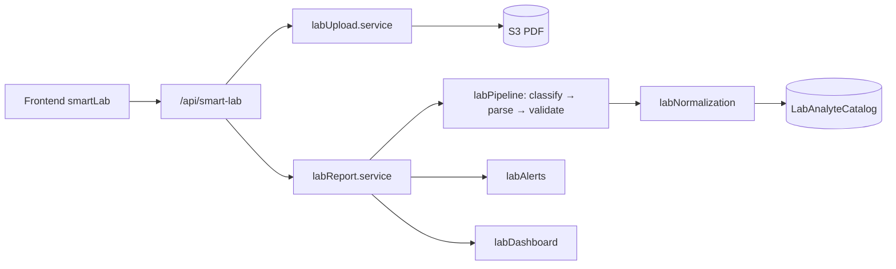

# Smart Lab (Laboratorio Inteligente)

Modulo opcional de Medilink360 para cargar PDFs de laboratorio, extraer resultados, normalizarlos contra un catalogo de analitos y presentar tendencias, alertas y dashboard **sin emitir diagnosticos**.

## Arquitectura



| Capa | Ubicacion | Responsabilidad |
|------|-----------|-----------------|
| Rutas | `backend/src/routes/smartLab.routes.ts` | Feature flag, auth, endpoints REST |
| Controlador | `backend/src/controllers/smartLab.controller.ts` | HTTP, permisos, disclaimer |
| Servicios | `backend/src/services/smartLab/*` | PDF, parseo, normalizacion, alertas, comparacion |
| UI | `frontend/src/pages/smartLab`, `frontend/src/components/smartLab` | Carga, revision, dashboard, comparador |
| Catalogo admin | `frontend/src/pages/admin/LabCatalogAdmin.jsx` | CRUD de analitos |

Flujo principal: **upload** → validacion PDF → almacenamiento → **process** (clasificar laboratorio → parser especifico → validacion clinica → normalizacion catalogo) → estado `pending_review` → medico **confirma** o rechaza → alertas y dashboard se refrescan.

## Feature flags (env)

| Variable | Default | Efecto |
|----------|---------|--------|
| `SMART_LAB_ENABLED` | `false` | Si es falso, todas las rutas `/api/smart-lab` responden 404 |
| `SMART_LAB_MAX_PDF_MB` | `15` | Tamano maximo del PDF |
| `SMART_LAB_PATIENT_UPLOAD_ENABLED` | `false` | Permite que rol PATIENT suba PDFs |
| `SMART_LAB_EXTERNAL_OCR_ENABLED` | `false` | OCR externo (stub; requiere integracion) |
| `SMART_LAB_REVIEW_THRESHOLD` | `0.9` | Umbral de confianza por fila (UI revision) |
| `SMART_LAB_AI_FALLBACK_ENABLED` | `false` | IA JSON fallback cuando parser determinístico falla |
| `SMART_LAB_OPENAI_MODEL` | `gpt-4o-mini` | Modelo OpenAI para fallback |
| `SMART_LAB_MISSING_FOLLOWUP_MONTHS` | `6` | Meses sin estudio confirmado para alerta de seguimiento |

Alias de ruta: `/api/labs` monta las mismas rutas que `/api/smart-lab`.

## Endpoints principales

Base: `/api/smart-lab` (requiere JWT y modulo habilitado).

| Metodo | Ruta | Roles | Descripcion |
|--------|------|-------|-------------|
| GET | `/status` | DOCTOR, ASISTENTE, PATIENT, ADMIN | Estado del modulo + disclaimer |
| POST | `/patients/:patientId/reports/upload` | * | Subir PDF (`multipart` campo `file`) |
| GET | `/patients/:patientId/reports` | * | Listar reportes |
| GET | `/reports/:reportId` | * | Detalle + resultados |
| POST | `/reports/:reportId/process` | * | Reprocesar extraccion |
| PATCH | `/reports/:reportId/results` | * | Correcciones pre-confirmacion |
| POST | `/reports/:reportId/confirm` | * | Confirmar estudio |
| POST | `/reports/:reportId/reject` | * | Rechazar estudio |
| GET | `/patients/:patientId/dashboard` | * | Semáforo por categoria |
| GET | `/patients/:patientId/alerts` | * | Alertas activas |
| POST | `/alerts/:alertId/dismiss` | * | Descartar alerta |
| GET | `/patients/:patientId/compare?analyteCatalogId=` | * | Serie temporal de un analito |
| GET | `/reports/compare?reportIdA=&reportIdB=` | * | Diff entre dos reportes confirmados |
| GET | `/catalog` | * | Catalogo activo (lectura) |
| GET | `/admin/catalog` | ADMIN | Catalogo (incluye inactivos salvo `includeInactive`) |
| POST | `/admin/catalog` | ADMIN | Crear analito |
| PATCH | `/admin/catalog/:id` | ADMIN | Actualizar analito |
| GET | `/admin/metrics` | ADMIN | Conteos agregados (reportes, alertas, catalogo) |

`*` = mismos roles que `labAuth` en rutas (DOCTOR, ASISTENTE, PATIENT, ADMIN) con reglas de acceso por paciente en servicios.

## Politica de no diagnostico

- Todo copy orientativo incluye `LAB_DISCLAIMER_ES` y prefijos en alertas (`LAB_ALERT_NON_DIAGNOSTIC_PREFIX`).
- Las alertas describen **valores fuera de rango reportado**, tendencias o seguimiento; **no** sugieren diagnostico ni tratamiento.
- El modulo **no** reemplaza la interpretacion clinica del medico tratante.
- Revision humana obligatoria: resultados quedan en `pending_review` hasta confirmacion.

## QA manual (checklist)

1. Activar `SMART_LAB_ENABLED=true` y reiniciar backend.
2. `GET /api/smart-lab/status` con token medico → `200` y disclaimer.
3. Subir PDF de laboratorio con texto seleccionable (no escaneo vacio).
4. Verificar reporte en `pending_review` con resultados parseados.
5. Corregir un valor en PATCH results y confirmar → estado `confirmed`.
6. Dashboard y alertas reflejan banderas (normal/alto/bajo) sin texto diagnostico.
7. Comparar dos fechas del mismo analito y dos reportes completos.
8. Admin: crear/editar analito en `/admin/catalog` y verificar match en nuevo upload.
9. Con flag apagado, mismas rutas → `404`.

## Pruebas automatizadas

```bash
cd backend
npm test -- --testPathPattern=smartLab
```

## Script CLI de upload (sin HTTP)

Valida PDF local, parsea y normaliza contra catalogo en BD:

```bash
cd backend
npx ts-node scripts/test-smart-lab-upload.ts path/to/lab.pdf
```

Requiere `SMART_LAB_ENABLED` solo para rutas HTTP; el script usa validacion/parseo directo (opcionalmente normalizacion si hay DB).
